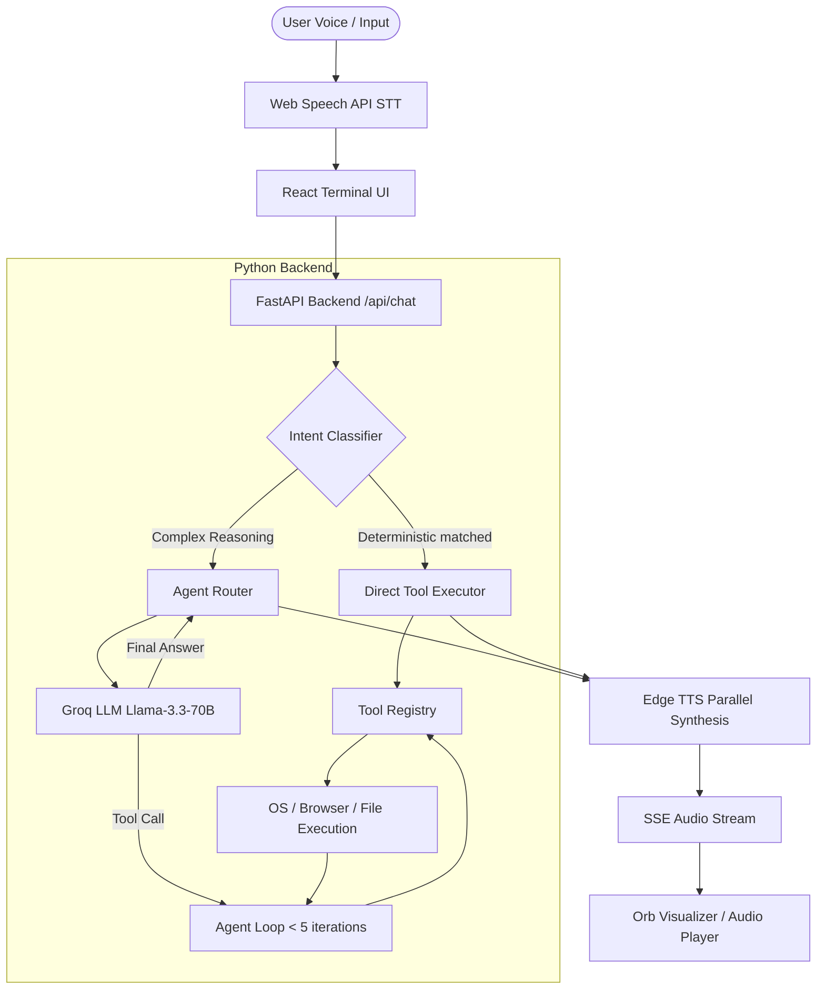

# JARVIS Architecture

This document describes the design and flow of the J.A.R.V.I.S. Core Backend and Frontend Agentic system.

## System Overview

JARVIS is built as a hybrid conversational assistant and autonomous AI Agent. It consists of a FastAPI Python backend and a React Javascript frontend. The architecture is split into a lightweight direct execution layer (Intent Classifier) and a reasoning/automation layer (LLM Tool Calling Agent Loop).

## Core Abstractions

1. **Tool Registry (`Backend/tools/registry.py`)**:
   - Decorator-based registration (`@registry.register`).
   - Exposes OpenAI-compatible schemas automatically.
   - Enforces platform checks, execution locks, parameter validation, and 10s timeouts.

2. **Intent Classifier (`Backend/tools/classifier.py`)**:
   - Rule-based regex and keyword matcher.
   - Bypasses LLM latency (runs in < 1ms) for direct command shortcuts (e.g. scrolling, app open, volume controls).
   - Automatically drops confidence and falls back to LLM if query contains reasoning words or exceeds 55 characters.

3. **Agent Router (`Backend/tools/router.py`)**:
   - Manages a multi-turn tool calling loop (limited to 5 iterations).
   - Retains conversation memory and active state contexts (`active_app`, `active_browser_tab`).
   - Compresses memory automatically via auto-summarization on history growth.

4. **Telemetry & Observability (`Backend/tools/telemetry.py`)**:
   - ContextVar tracing propagates `request_id`, `session_id`, and `conversation_id` transparently.
   - Logging outputs structured JSON to rotating files under `logs/`.
   - Exposes process status and stats via `/health`, `/ready`, and `/metrics`.
