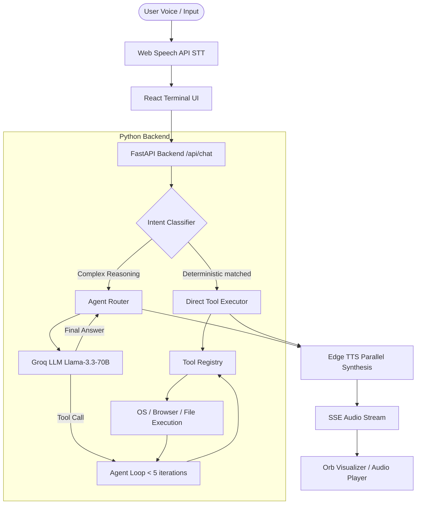

# JARVIS Architecture

This document describes the design and flow of the J.A.R.V.I.S. Core Backend and Frontend Agentic system.

## System Overview

JARVIS is built as a hybrid conversational assistant and autonomous AI Agent. It consists of a FastAPI Python backend and a React Javascript frontend. The architecture is split into a lightweight direct execution layer (Intent Classifier) and a reasoning/automation layer (LLM Tool Calling Agent Loop).

```mermaid
graph TD
    User([User Voice / Input]) --> STT[Web Speech API STT]
    STT --> Terminal[React Terminal UI]
    Terminal --> Backend[FastAPI Backend /api/chat]
    
    subgraph Python Backend
        Backend --> Classifier{Intent Classifier}
        
        %% Direct Path
        Classifier -- "Deterministic matched" --> Direct[Direct Tool Executor]
        Direct --> Registry[Tool Registry]
        
        %% Complex Path
        Classifier -- "Complex Reasoning" --> Router[Agent Router]
        Router --> LLM[Groq LLM Llama-3.3-70B]
        LLM -- "Tool Call" --> Loop[Agent Loop < 5 iterations]
        Loop --> Registry
        Registry --> Exec[OS / Browser / File Execution]
        Exec --> Loop
        LLM -- "Final Answer" --> Router
    end
    
    Router --> TTS[Edge TTS Parallel Synthesis]
    Direct --> TTS
    TTS --> Stream[SSE Audio Stream]
    Stream --> Visualizer[Orb Visualizer / Audio Player]
```

## Core Abstractions

1. **Tool Registry (`Backend/tools/registry.py`)**:
   - Decorator-based registration (`@registry.register`).
   - Exposes OpenAI-compatible schemas automatically.
   - Enforces platform checks, execution locks, parameter validation, and 10s timeouts.

2. **Intent Classifier (`Backend/tools/classifier.py`)**:
   - Rule-based regex and keyword matcher.
   - Bypasses LLM latency (runs in < 1ms) for direct command shortcuts (e.g. scrolling, app open, volume controls).
   - Automatically drops confidence and falls back to LLM if query contains reasoning words or exceeds 55 characters.

3. **Agent Router (`Backend/tools/router.py`)**:
   - Manages a multi-turn tool calling loop (limited to 5 iterations).
   - Retains conversation memory and active state contexts (`active_app`, `active_browser_tab`).
   - Compresses memory automatically via auto-summarization on history growth.

4. **Telemetry & Observability (`Backend/tools/telemetry.py`)**:
   - ContextVar tracing propagates `request_id`, `session_id`, and `conversation_id` transparently.
   - Logging outputs structured JSON to rotating files under `logs/`.
   - Exposes process status and stats via `/health`, `/ready`, and `/metrics`.

5. **Persistent Autonomous Scheduler (`Backend/autonomous/`)**:
   - Reuses SQLite database at `logs/jarvis_memory.db` to persist scheduled jobs and execution records across application restarts.
   - `ScheduleParser` parses natural language expressions ("Every morning at 8", "Every weekday", "Every 30 minutes") into next execution timestamps.
   - `ProactiveTaskRegistry` enables dynamic task registration for Memory, Predictive Intelligence, Learning, Self-Optimization, Vision, and AI Provider tasks.
   - `PersistentSchedulerEngine` executes tasks in a non-blocking background `asyncio` loop with overlap prevention, timeout enforcement, exponential backoff retries, and FastAPI REST endpoints (`/api/scheduler/*`).

6. **Identity & Security Subsystem (`Backend/identity/` & `Backend/security/`)**:
   - `LocalIdentityManager` auto-provisions and persists passwordless local user profile and Ed25519 device identity on first boot.
   - OS Secure Credential Storage Subsystem (`Backend/security/keystore/`) supporting Apple Keychain, Windows DPAPI, Linux Secret Service, and AES-256-GCM encrypted fallback with random 256-bit master secret.
   - High-level non-exportable cryptographic API (`sign_data`, `verify_signature`, `export_public_key_pem`, `rotate_keypair`, `health`).
   - Transactional 7-step legacy migration with automatic rollback.
   - Device trust lifecycle manages trust states (`UNTRUSTED`, `PROVISIONAL`, `TRUSTED`, `REVOKED`).
   - SQLite persistence (`logs/jarvis_memory.db`) tracks `schema_version` migrations (`v1_identity_security`).
   - Decoupled `SessionManager` manages session issuance, access token validation, token refresh, and session revocation.

7. **Cloud Backend Infrastructure & Alembic Migration Architecture (`Cloud/`)**:
   - Standalone FastAPI API Gateway subsystem (`main.py` on Port 8001) providing multi-device cloud controls without affecting local offline execution.
   - **Alembic Database Migration System (`Cloud/alembic/`)**: Schema evolution is driven strictly by declarative SQLAlchemy 2.x ORM models (`Cloud/models/orm.py`) as single source of truth. Zero runtime DDL (`CREATE TABLE IF NOT EXISTS`).
   - Pre-stamping legacy schema validator and non-automatic production startup verification (`Cloud/database/schema_verifier.py`).
   - Multi-instance migration concurrency lock manager (`Cloud/database/migration_lock.py`).
   - Repositories for Users, Devices, Sessions, and Audit Logs.
   - Security Service executing Ed25519 challenge-response verification and issuing short-lived JWT Access Tokens & 30-day Refresh Tokens.
   - Sliding window Rate Limiter middleware (100 req/min) & Prometheus telemetry exporter.
   - Production Docker Compose deployment (`docker-compose.yml` for FastAPI + PostgreSQL 16 + Redis).

8. **Cloud Synchronization Engine (`Cloud/sync/` & `Cloud/websocket/`)**:
   - Real-time authenticated WebSocket Gateway (`ws://localhost:8001/ws/sync`) handling protocol message envelopes (`SyncMessageEnvelope`).
   - Version & capability negotiation with 5 reserved future message types (`PLUGIN_SYNC`, `VOICE_SYNC`, `FILE_SYNC`, `MODEL_SYNC`, `NOTIFICATION`).
   - 7-State WebSocket Connection Lifecycle (`CONNECTING` → `AUTHENTICATING` → `SYNCHRONIZING` → `ACTIVE` → `IDLE` → `RECONNECTING` → `DISCONNECTED`).
   - **AES-256-GCM Application-Layer Payload Encryption over WSS Transport** with threshold payload compression (default: 1024 bytes).
   - Domain-specific CRDT merge engine (`LWWRegister`, `ORSet`, `LWWMap`) resolving conflicts across Settings, Preferences, Tasks, Memory, and Conversation Metadata.
   - Standardized Checkpoint Metadata Manager (`CheckpointMetadata`) and watermark tracking.
   - Redis Streams Event Bus (`RedisStreamsBus`) managing stream channels (`jarvis.sync.events`, `jarvis.device.events`, `jarvis.telemetry.events`) with consumer groups and in-memory fallback.
   - Decoupled `EventPersistenceService` managing stream events, `XACK`, and PEL recovery.
   - Resilient `ReplayEngine` handling offline update queueing, sequence number ordering, checkpoint resumption, and duplicate message deduplication.
   - State-change-only `PresenceService` optimizing network traffic during 15s heartbeats.

9. **Client-Side Synchronization Architecture (`Client/sync/` & `Client/services/`)**:
   - Dedicated client-side synchronization subsystem providing local-first, offline-first operation for Desktop assistant and Mobile client instances.
   - Async `WebSocketSyncClient` managing 7-state connection machine (`DISCONNECTED` → `CONNECTED`), 15s heartbeat timers with 45s stale socket detection, background frame listener loop, exponential backoff reconnects (`1s` → `2s` → `4s` → `8s` → max `30s`), and automatic JWT token refresh.
   - `OfflineStore` SQLite driver (`logs/client_sync.db` or in-memory) storing checkpoints, watermarks, credentials, state cache, and durable pending operations.
   - `ReplayQueue` buffering local offline operations with durable operation ACK deletion semantics and idempotent message deduplication.
   - `ConflictHandler` coordinating CRDT automatic merges, producing review objects, and handling manual resolution overrides (`user_override_local` & `user_override_remote`).
   - `IntelligentSyncScheduler` managing trigger-based background synchronization (startup, local change, network restoration, 60s periodic, manual).
   - `ConnectionMonitor` exposing real-time connection state (`DISCONNECTED`, `CONNECTING`, `AUTHENTICATING`, `SYNCHRONIZING`, `CONNECTED`, `RECONNECTING`, `ERROR`), quality score, and UI listener callbacks.
   - Master `ClientSyncManager` entrypoint and high-level `CloudSyncService` API.

10. **Remote Intelligence & Cross-Device Execution Mesh (`Cloud/intelligence/` & `Cloud/services/`)**:
    - **Remote LLM Inference Offloader (`RemoteInferenceOffloader`)**: Multi-provider LLM routing (Groq, Gemini, OpenRouter) with independent `CircuitBreakers` (`CLOSED` → `OPEN` → `HALF_OPEN`) and streaming SSE responses.
    - **Cross-Device Context Sharing Mesh (`ContextMeshService`)**: Aggregates active device context snapshots with versioning, confidence scores, and TTL expirations (`CrossDeviceContextProvider`).
    - **Cryptographic Remote Execution Trust Model (`RemoteAgentService`)**: Zero-Trust remote agent command execution verifying Ed25519 payload signatures, nonces against replay cache, and capability authorization.
    - **Distributed Job Orchestrator (`JobOrchestrator`)**: Job lifecycle manager (`QUEUED` → `RUNNING` → `COMPLETED` → `FAILED` → `CANCELLED`), priority queues, retries, and timeouts.
    - **Cloud Scheduler Relay (`CloudSchedulerRelay`)**: Automated task relay executing background autonomous tasks in Cloud when primary scheduling device goes offline.
    - **Proactive Multi-Device Notification Mesh (`NotificationMeshService`)**: Real-time notification broadcast engine over WebSocket gateway channels.
