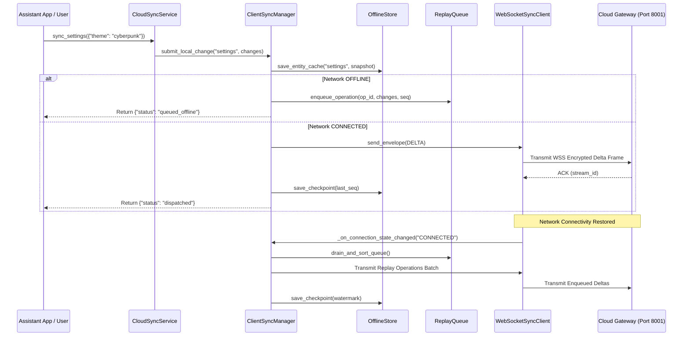
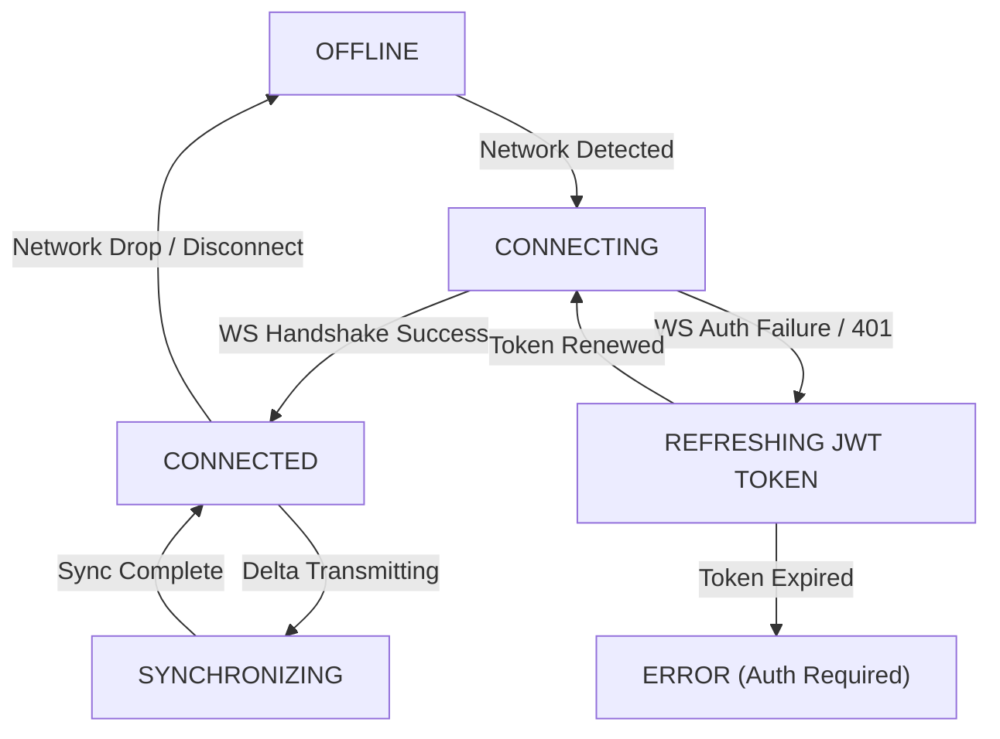

# J.A.R.V.I.S. Client Synchronization Architecture (Phase 8.4)

Master technical specification for the client-side synchronization architecture (`Client/`) connecting desktop and mobile personal assistant instances with the J.A.R.V.I.S. Cloud Platform (`ws://localhost:8001/ws/sync`).

---

## 1. Overview & Principles

The Client Synchronization Subsystem operates strictly on an **Offline-First** philosophy. All user operations (updating settings, saving long-term memories, modifying tasks) execute against local storage immediately. When offline, changes buffer in a persistent replay queue and synchronize seamlessly once network connectivity returns.

### Core Principles
- **Local-First Execution**: Zero user actions blocked by network availability or server latency.
- **Unified Entrypoint (`ClientSyncManager`)**: Central coordinator for connection state, local caching, replay, and CRDT conflict resolution.
- **Deterministic Conflict Merging**: Domain-specific CRDT algorithms (`LWWRegister`, `ORSet`, `LWWMap`) resolve concurrent edits automatically.
- **Resilient Reconnection**: Exponential backoff reconnect strategy (`1s` → `2s` → `4s` → `8s` → max `30s`) with automatic JWT access token refresh on expiry.

---

## 2. Component Structure (`Client/`)

```text
Client/
├── sync/
│   ├── protocol.py             # ClientSyncEnvelope & ClientMessageType schemas
│   ├── websocket_client.py     # Async WebSocketSyncClient (Exponential backoff & token refresh)
│   ├── offline_store.py        # SQLite persistent store (Checkpoints, state cache)
│   ├── replay_queue.py         # Persistent offline operation buffer & sequence-ordered worker
│   ├── conflict_handler.py     # CRDT merge coordinator & ConflictReviewNotification producer
│   ├── scheduler.py            # IntelligentSyncScheduler (Triggers: startup, change, network, periodic)
│   ├── connection_monitor.py   # ConnectionMonitor (States: CONNECTED, CONNECTING, OFFLINE, SYNCHRONIZING)
│   ├── sync_metrics.py         # Client telemetry & metrics collector
│   └── sync_manager.py         # Master ClientSyncManager orchestrator
│
└── services/
    └── cloud_sync_service.py   # High-level CloudSyncService API for Desktop & Mobile clients
```

---

## 3. Sequence Flow Diagrams

### Offline Local Change & Replay Lifecycle



---

## 4. Connection State Machine



---

## 5. High-Level Service API (`CloudSyncService`)

```python
from Client.services.cloud_sync_service import cloud_sync_service

# 1. Initialize Client
cloud_sync_service.initialize(
    user_id="usr_001",
    device_id="dev_desktop_01",
    access_token="eyJ...",
    refresh_token="rtk_..."
)

# 2. Sync Local Changes
cloud_sync_service.sync_settings({"theme": "dark_mode_pro"})
cloud_sync_service.sync_memory({"fact": "User prefers Llama-3.3-70B"})
cloud_sync_service.sync_tasks({"task_id": "101", "status": "completed"})

# 3. Inspect Connection & Metrics Status
status = cloud_sync_service.get_status()
# Returns: {"connection": {"state": "CONNECTED", ...}, "pending_offline_ops": 0, ...}
```
