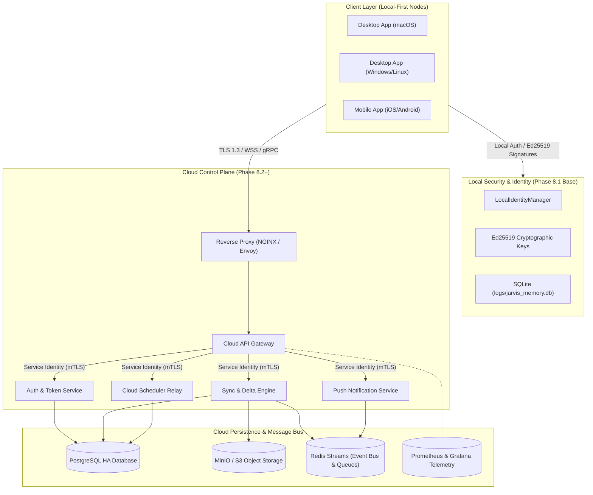
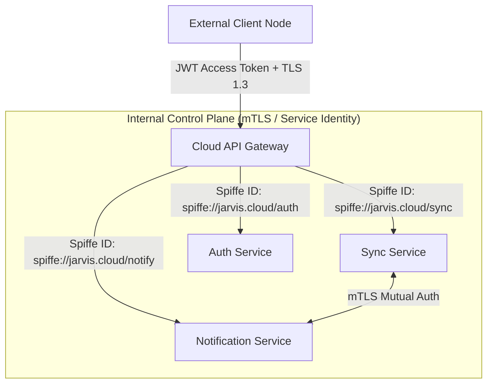
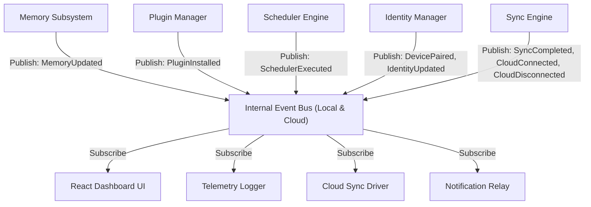
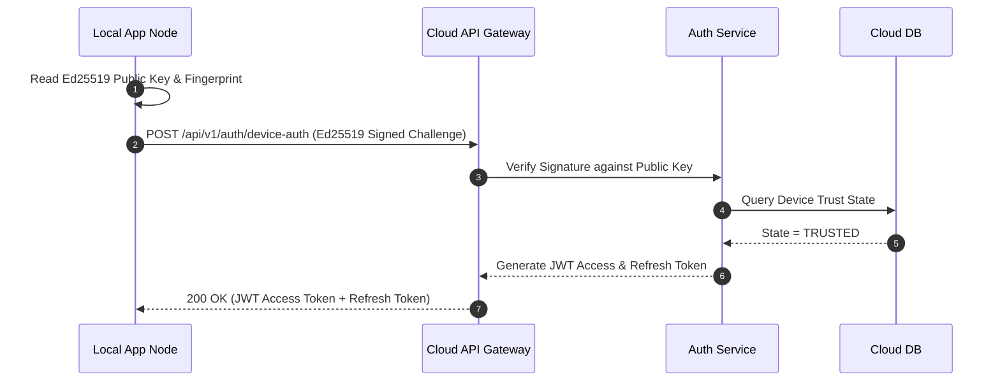
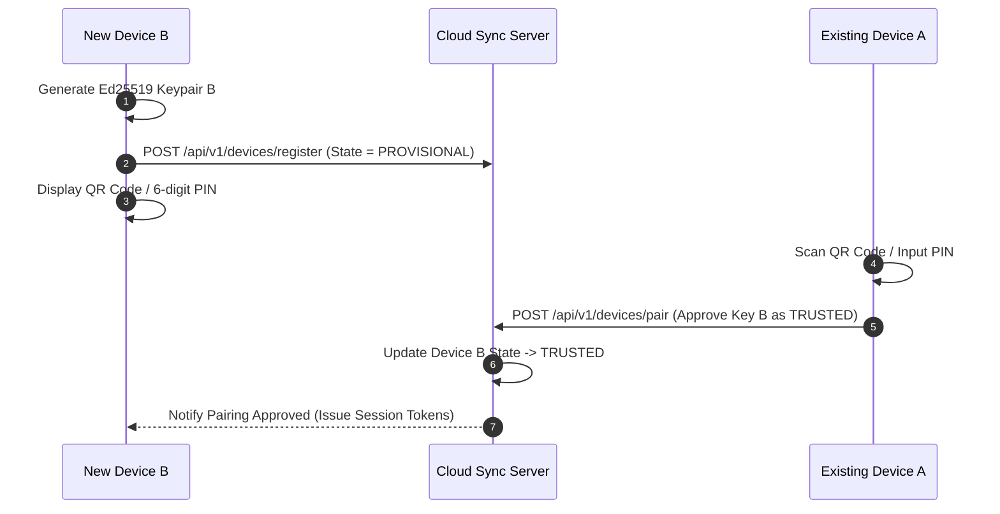
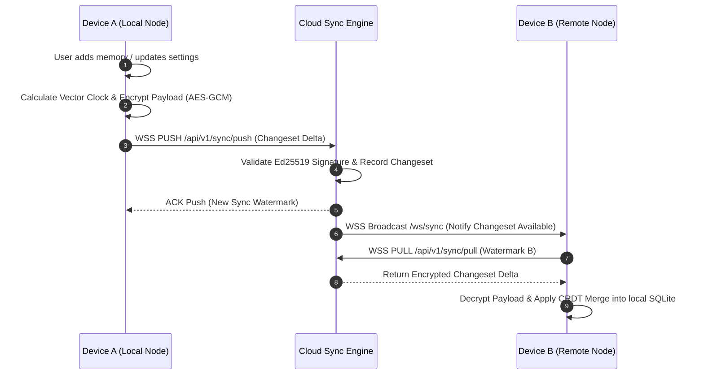
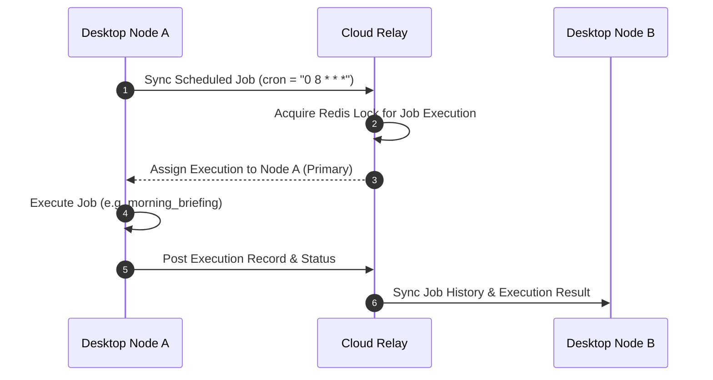

# J.A.R.V.I.S. Cloud Architecture Specification

**Document Version:** 2.0.0 (Refined Specification)  
**Phase Target:** Phase 8 (Cloud Platform & Multi-Device Sync Architecture)  
**Status:** Approved Master Specification  
**Architect:** Chief Software Architect, J.A.R.V.I.S. Project  

---

## 1. Vision

To transform J.A.R.V.I.S. from a single-device local assistant into a secure, multi-device intelligent ecosystem. J.A.R.V.I.S. connects personal devices (laptops, mobile devices, desktop nodes) through a zero-trust, end-to-end encrypted cloud sync plane while preserving a strict **LOCAL-FIRST, OFFLINE-FIRST** operational model.

---

## 2. Goals

- **Local-First & Offline-First**: Complete functionality offline. Cloud connectivity is purely additive and 100% optional.
- **Zero-Trust & End-to-End Encrypted Sync**: Sensitive memory, settings, and scheduler data are encrypted on the client device using Ed25519/AES-GCM before transmission.
- **Seamless Multi-Device Continuity**: Sync user context, memory facts, background tasks, and preferences across macOS, Windows, Linux, iOS, and Android.
- **Incremental & Efficient Sync**: Vector clock/CRDT delta syncing minimizes bandwidth and handles intermittent network connectivity cleanly.
- **Strict Data Isolation**: User data is partitioned by `user_id` and signed by verified `device_id` keypairs.

---

## 3. Non-Goals

- **No Mandated Cloud Account**: Cloud authentication will never be forced.
- **No Cloud Vendor Lock-in**: Cloud services can be self-hosted via standard Docker/Kubernetes helm charts.
- **No Plaintext Storage of Secrets**: API keys, private Ed25519 keys, and OS credentials are NEVER uploaded to cloud storage.
- **No Public Marketplace Infrastructure in Phase 8**: Public plugin distribution is deferred to Phase 9.

---

## 4. High-Level Architecture



---

## 5. System Components & Responsibilities

| Component | Responsibility |
|---|---|
| **Desktop App Node** | Primary local execution environment running LLM tools, intent classifier, and local SQLite memory (`jarvis_memory.db`). |
| **Identity Layer (Phase 8.1)** | Generates Ed25519 keypairs, manages local user profile, tracks device trust states (`TRUSTED`, `REVOKED`), and signs outbound sync payloads. |
| **Cloud API Gateway** | Entry point routing HTTPS/WSS/gRPC traffic, rate-limiting, TLS termination, protocol capability negotiation, and request validation. |
| **Authentication Service** | Verifies device signatures, issues OAuth/JWT tokens for external clients, and manages cloud user credentials. |
| **Sync Service** | Manages entity-based delta updates, vector clocks, CRDT conflict resolution, and WebSocket real-time synchronization. |
| **Memory Service** | Relays encrypted memory facts, knowledge graph nodes, and embeddings between paired devices. |
| **Notification Service** | Dispatches real-time push notifications (APNs, FCM, WebPush) when background tasks finish. |
| **Scheduler Service** | Synchronizes cron/interval job definitions across trusted devices and coordinates execution locks via Redis. |
| **Plugin Service** | Synchronizes installed plugin manifests, configuration states, checksums, and trust signatures across user devices. |
| **Storage Layer** | PostgreSQL (relational metadata/sync states), Redis Streams (event bus queues), MinIO/S3 (encrypted blobs). |

---

## 6. Internal Service Authentication & Identity Architecture

Internal service-to-service communication within the Cloud Control Plane bypasses external client JWT tokens in favor of lightweight, high-performance **Service Identity (mTLS)**:



- **External Clients**: Authenticate at the Cloud API Gateway using short-lived JWT Access Tokens issued by `AuthService`.
- **Internal Microservices**: Authenticate to each other using Mutual TLS (mTLS) with short-lived X.509 SVIDs (SPIFFE/SPIRE). Internal calls do NOT perform redundant JWT parsing or database token verification.

---

## 7. Redis Streams Event Bus Architecture

Reliable event streaming, background task queueing, and asynchronous pub/sub messaging rely on **Redis Streams** instead of standard Redis Pub/Sub:

- **Consumer Groups**: Each microservice instance belongs to a dedicated consumer group (e.g. `sync-workers`, `notification-workers`), ensuring at-least-once processing across horizontally scaled instances.
- **Acknowledgements (XACK)**: Messages are explicitly acknowledged (`XACK stream_name group_name message_id`) only after successful processing.
- **Pending Entries List (PEL) & Replay**: Unacknowledged messages due to worker crashes are reclaimed via `XPENDING` and reprocessed by healthy workers.
- **Ordering**: Stream entry IDs (`timestamp-sequence`) guarantee strict monotonic chronological ordering per user partition.
- **Recovery**: On node boot, workers scan their Pending Entries List to re-evaluate in-flight events before fetching new stream entries.

---

## 8. Entity-Based Synchronization Specifications

Synchronization is partitioned by specific entity domains rather than generic unstructured changesets:

| Entity Domain | Conflict Strategy | Merge Strategy | Priority | Encryption |
|---|---|---|---|---|
| **Identity** | Last-Write-Wins (LWW) | Highest timestamp wins; tie-break via device ID string | High | Unencrypted Metadata |
| **Memory** | Additive CRDT | LWW-Element-Set; tombstone markers for deleted facts | High | AES-256-GCM (E2EE) |
| **Scheduler** | State Vector Clock | Primary node execution lock; union of active cron jobs | Medium | AES-256-GCM (E2EE) |
| **Settings** | Field-level LWW | Merges disjoint key-value maps per setting key | Low | AES-256-GCM (E2EE) |
| **Plugin State** | Checksum Verification | Trust signature match + highest manifest version | Low | Manifest Metadata |
| **Conversation Metadata**| Append-Only Log | Sequence ID append with gap detection | Medium | AES-256-GCM (E2EE) |

---

## 9. Protocol & Feature Negotiation Architecture

Upon connecting to the Cloud API Gateway via WebSocket or gRPC, the client node initiates a **Protocol Handshake** (`POST /api/v1/handshake`) to negotiate capability flags:

```json
{
  "client_protocol_version": "2.0",
  "device_id": "dev_29b4181a34b545f7",
  "capabilities": {
    "supported_ai_providers": ["groq", "gemini", "openrouter", "ollama"],
    "plugin_support": true,
    "vision_support": true,
    "scheduler_support": true,
    "max_payload_bytes": 10485760,
    "compression_support": ["gzip", "zstd"]
  }
}
```

The gateway responds with negotiated active features and maximum allowed batch sizes, ensuring older client devices interact seamlessly with modern cloud clusters.

---

## 10. Lightweight Internal Event Bus

The local backend and cloud microservices dispatch events over an **Internal Event Bus**:



---

## 11. Plugin Synchronization Specifications

Plugin synchronization transmits manifest declarations without shipping unvetted raw Python source code over the cloud:

- **Synced Properties**: Manifest ID, Version string, Configuration parameters, Required permissions whitelist, SHA-256 Checksum (`plugin_checksum`), and Developer Trust Signature.
- **Verification Protocol**:
  1. The receiving device checks `plugin_checksum` against local plugin cache.
  2. If missing, the receiving device verifies the Ed25519 developer signature on the manifest before enabling local execution.
  3. If permissions exceed granted local policy, the plugin state is set to `PROVISIONAL` until approved by the user in the UI.

---

## 12. Data Classification Matrix

| Classification | Storage Location | Sync Allowed | Examples |
|---|---|---|---|
| **LOCAL ONLY** | Local Node Only | ❌ NEVER | LLM API Keys (`GROQ_API_KEY`, `OPENROUTER_API_KEY`), Private Ed25519 Keys (`device_ed25519_key.pem`), Temp WAV audio files, Browser session cookies, Raw OS credentials. |
| **SYNCED** | Encrypted Cloud Storage | ✅ OPTIONAL | Conversation summaries, User preferences, Memory facts, Background scheduler jobs, Installed plugin manifests, Custom system prompts. |
| **NEVER SYNC** | Transient RAM Only | ❌ NEVER | Private encryption keys in memory, Active process handles, OS-specific window handles, Direct microphone/camera buffers. |

---

## 13. Trust Model

- **Device Key Authority**: Each device generates an Ed25519 signing keypair upon installation. The public key is registered with the cloud identity ledger.
- **Device Trust States**:
  - `UNTRUSTED`: Newly detected device. Access denied.
  - `PROVISIONAL`: Pending key verification (QR code / PIN pairing).
  - `TRUSTED`: Fully authenticated device allowed to sync encrypted payloads.
  - `REVOKED`: Blocked device. All active tokens invalidated immediately.

---

## 14. Security Model

- **Transport Security**: TLS 1.3 for all HTTP/WebSocket API communication.
- **End-to-End Payload Encryption (E2EE)**: Sensitive memory payloads are encrypted on the client using AES-256-GCM prior to network dispatch.
- **Replay Protection**: Sync payloads include a nonce, Ed25519 signature, and timestamp (rejected if `> 30s` clock skew).
- **Token Model**: Short-lived JWT Access Tokens (1 hour) and cryptographically secure Refresh Tokens (30 days) stored securely in local OS Keyring.

---

## 15. Identity Flow Diagram



---

## 16. Device Registration & Pairing Flow Diagram



---

## 17. Synchronization Flow Diagram



---

## 18. Scheduler & Remote Task Sync Diagram



---

## 19. Extended Monitoring & Telemetry Specification

The Prometheus & Grafana telemetry suite tracks:

- **Sync Latency (ms)**: Time taken to push, relay, and apply entity changesets.
- **Conflict Rate (%)**: Percentage of sync operations requiring CRDT or LWW tie-break merges.
- **Scheduler Execution Latency (ms)**: Latency of scheduled job executions across nodes.
- **Plugin Failures**: Error count of dynamic plugin loading or execution faults.
- **Device Health & Reconnect Count**: Number of WebSocket reconnect attempts per device.
- **Offline Queue Depth**: Total number of pending local changesets waiting for network connectivity.
- **Merge Duration (ms)**: Client CPU time spent performing CRDT entity state merges.

---

## 20. Component Responsibility Matrix

| Service Component | Primary Responsibility | Input Data | Output Data | Security Protocol |
|---|---|---|---|---|
| **API Gateway** | Routing, Rate-limiting, TLS | HTTP/WSS Requests | Sanitized Proxied Requests | TLS 1.3, Rate Limit 100/min |
| **Auth Service** | Token issuance, Key verification | Ed25519 Challenge Signature | JWT Access & Refresh Tokens | Ed25519 Verification |
| **Sync Service** | Delta sync, CRDT conflict merge | Encrypted Changesets | Synced Deltas | AES-256-GCM + E2EE |
| **Notification Service**| Push dispatching | Job completion events | APNs / FCM payloads | OAuth 2.0 / FCM Tokens |

---

## 21. API Inventory Specification (Endpoints Only)

- `POST /api/v1/handshake` (Protocol & feature negotiation)
- `POST /api/v1/auth/device-auth`
- `POST /api/v1/devices/register`
- `POST /api/v1/devices/pair`
- `GET /api/v1/devices/list`
- `DELETE /api/v1/devices/{device_id}`
- `GET /api/v1/identity/profile`
- `PUT /api/v1/identity/profile`
- `POST /api/v1/sync/push`
- `POST /api/v1/sync/pull`
- `GET /api/v1/sync/status`
- `POST /api/v1/memory/sync`
- `POST /api/v1/scheduler/sync`
- `POST /api/v1/plugins/sync`
- `POST /api/v1/notifications/push`
- `GET /api/v1/health`

---

## 22. Database Inventory Schema Specification

```sql
-- Users Table
CREATE TABLE cloud_users (
    user_id VARCHAR(64) PRIMARY KEY,
    created_at TIMESTAMP WITH TIME ZONE DEFAULT CURRENT_TIMESTAMP,
    updated_at TIMESTAMP WITH TIME ZONE DEFAULT CURRENT_TIMESTAMP
);

-- Devices Table
CREATE TABLE cloud_devices (
    device_id VARCHAR(64) PRIMARY KEY,
    user_id VARCHAR(64) REFERENCES cloud_users(user_id),
    device_name VARCHAR(128) NOT NULL,
    platform VARCHAR(32) NOT NULL,
    public_key TEXT NOT NULL,
    public_key_fingerprint VARCHAR(128) NOT NULL,
    trust_state VARCHAR(32) NOT NULL DEFAULT 'PROVISIONAL',
    created_at TIMESTAMP WITH TIME ZONE DEFAULT CURRENT_TIMESTAMP
);

-- Sync Changesets Table
CREATE TABLE sync_changesets (
    changeset_id VARCHAR(64) PRIMARY KEY,
    user_id VARCHAR(64) REFERENCES cloud_users(user_id),
    device_id VARCHAR(64) REFERENCES cloud_devices(device_id),
    entity_type VARCHAR(32) NOT NULL,
    vector_clock JSONB NOT NULL,
    encrypted_payload TEXT NOT NULL,
    created_at TIMESTAMP WITH TIME ZONE DEFAULT CURRENT_TIMESTAMP
);
```

---

## 23. Recommended Implementation Roadmap

| Phase | Title | Objectives | Key Deliverables | Complexity |
|---|---|---|---|---|
| **Phase 8.2** | Cloud Backend Infrastructure | Build API Gateway, Auth Service (mTLS), and PostgreSQL storage. | Docker Compose, FastAPI Cloud Server, Ed25519 Auth. | High |
| **Phase 8.3** | Synchronization Engine | Build WSS real-time delta sync, Redis Streams queues, CRDT merge, and AES-GCM encryption. | SyncEngine, WebSocket relay, Client Sync Driver. | Very High |
| **Phase 8.4** | Multi-Device Platform | Device pairing via QR code/PIN, remote task locks, and device revocation UI. | Device Pairing UI, Redis locks, Push Notifications. | Medium |
| **Phase 8.5** | Remote Intelligence | Cross-device context sharing, cloud scheduler relay, and proactive notification mesh. | Multi-node prompt sharing, Cross-device Briefings. | High |
