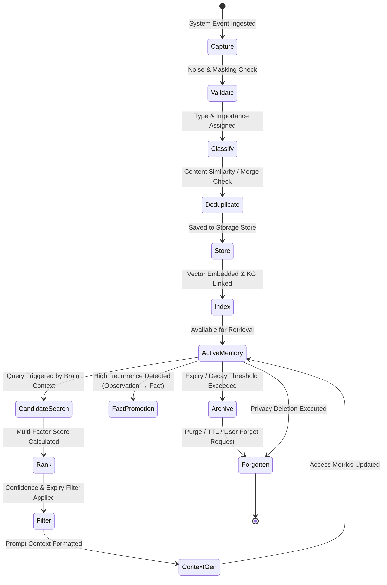
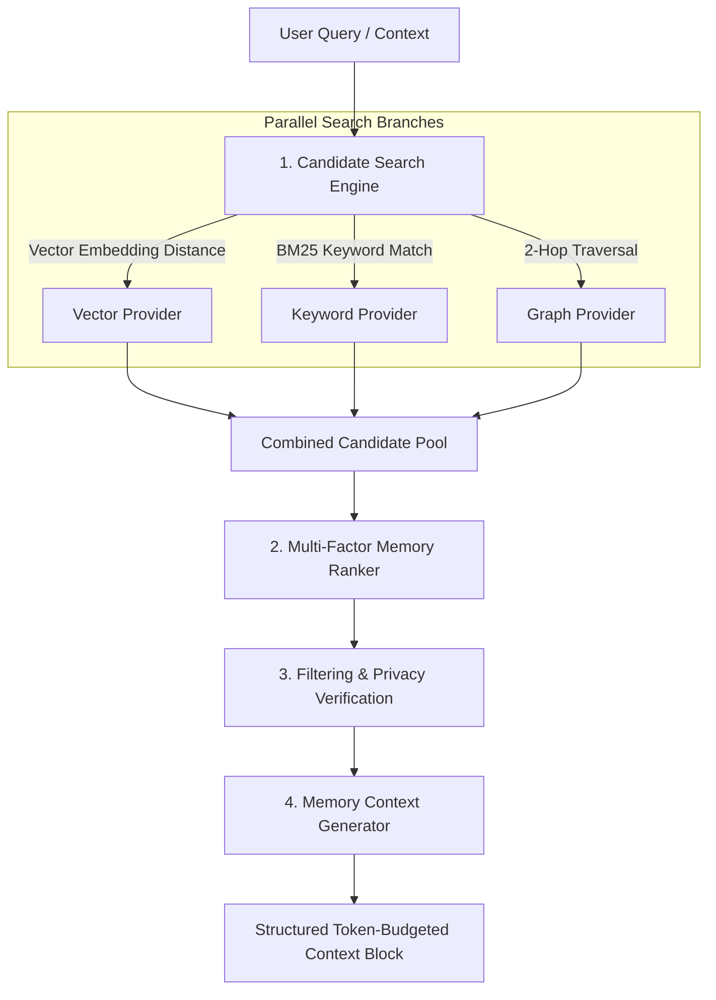

# JARVIS Phase 4 — Long-Term Memory & Knowledge Graph Architecture Specification (Refined)

**Architecture Version**: 4.1 (Senior Architecture Refinement & Frozen Specification)  
**Status**: Architecture Approved & Frozen 🧊  
**Core Boundary Principle**: **Perception (Voice/Vision) → Memory Subsystem → Brain (Reasoning) → Planner → Executor → Tools**.

---

## 1. Executive Summary & Phase Philosophy

Phase 4 equips JARVIS with long-term memory, continuous knowledge accumulation, and graph-relational reasoning over time.

Memory in JARVIS is a **first-class passive perception & retrieval subsystem**.

### Core Architectural Principles:
1. **Brain Isolation & Pure Reasoning**: The `Brain` is a pure reasoning unit. It **NEVER** manages memory storage, vector similarity calculations, graph index updates, or decay algorithms directly.
2. **Unified MemoryManager Facade**: All interaction with the memory subsystem passes through a single entry point: `MemoryManager`. Neither the `Brain` nor `MemoryContextProvider` ever interacts with storage providers directly.
3. **Context-Driven Retrieval**: Memory is injected into the Brain strictly through the established `BaseContextProvider` abstraction (`MemoryContextProvider`).
4. **Observation vs. Fact Separation**: Transient events (*Observations*) are cleanly separated from persistent consolidated knowledge (*Facts*). Repeated observations promote into facts.
5. **Provider Agnosticism**: Storage and embedding interfaces are abstract (`BaseMemoryStorageProvider`, `BaseVectorStorageProvider`, `BaseGraphStorageProvider`).
6. **Privacy & User Control First**: Selective forgetting, content masking, retention policies, and hard purging are enforced at the core facade level.

---

## 2. Refined High-Level Architecture & Data Flow

```mermaid
graph TD
    subgraph Inputs ["Input & Perception Sources"]
        Conv[Conversation Turns]
        Actions[Executed Actions & Workflows]
        Vis[Visual Observations]
        Files[Workspace & Project Files]
    end

    Inputs -->|Events / Data Streams| Ingestion[Memory Ingestion Pipeline]

    subgraph Memory Ingestion ["Ingestion Subsystem"]
        Ingestion --> Cap[Capture]
        Cap --> Val[Validate & Mask]
        Val --> Class[Classify & Extract Entities]
        Class --> Dedup[Deduplicate & Merge]
    end

    Dedup -->|Clean Memory Data| MemMgr[MemoryManager Facade]

    subgraph Memory Storage ["Storage & Knowledge Graph Subsystem"]
        MemMgr -->|Store / Index| StorOrch[Storage Orchestrator]
        StorOrch --> Episodic[(Episodic Memory)]
        StorOrch --> Semantic[(Semantic Memory / Facts)]
        StorOrch --> Procedural[(Procedural Memory)]
        StorOrch --> Preference[(Preference Memory)]
        StorOrch --> Project[(Project Memory)]
        StorOrch --> KG[(Knowledge Graph Engine)]
    end

    Query[Brain Intent / Active Prompt] -->|Fetch Memory Context| MemContext[MemoryContextProvider]
    MemContext -->|Query Request| MemMgr

    subgraph Staged Retrieval ["Staged Retrieval Pipeline (via MemoryManager)"]
        MemMgr --> CSearch[Candidate Search (Vector + Keyword + Graph)]
        CSearch --> MRank[Multi-Factor Ranker]
        MRank --> MFilter[Relevance & Privacy Filter]
        MFilter --> CGen[Memory Context Generator]
    end

    CGen -->|Ranked Memory Context Block| MemContext
    MemContext -->|Structured Prompt Context| Brain[Brain Package / Backend/brain/]

    subgraph Brain & Action ["Brain Layer"]
        Brain -->|Execution Plan| Executor[Execution Manager / Tools]
    end
```

```
Perception / Conversation / Event Inputs
     ↓
Memory Ingestion Pipeline (Capture → Validate → Classify → Deduplicate)
     ↓
MemoryManager (Single Facade Entry Point)
     ↓
Storage Orchestrator → (Episodic / Semantic / Procedural / Preference / Project + Knowledge Graph)
     ↓
[Brain Prompt Context Request] → MemoryContextProvider
     ↓
MemoryManager.retrieve_context()
     ↓
Staged Retrieval Pipeline:
  1. Candidate Search (Vector Distance + BM25 Keywords + 2-Hop Graph Traversal)
  2. Multi-Factor Ranker (Similarity + Recency + Importance + Frequency + KG Links)
  3. Filtering & Privacy Verification (Confidence Thresholds, Masking, Retention Policies)
  4. Memory Context Generation (Formatted Token-Budgeted Prompt Block)
     ↓
Brain (DesktopActionEngine & ToolPlanner)
```

---

## 3. Refined Package & Folder Structure (`Backend/memory/`)

```
Backend/
└── memory/
    ├── __init__.py                → Package Public Interface & MemoryManager Export
    ├── manager.py                 → MemoryManager (Central Subsystem Facade)
    ├── models/                    → Data Schemas & Pydantic Definitions
    │   ├── __init__.py
    │   ├── memory.py              → Memory, MemoryChunk, MemoryMetadata, MemoryType
    │   ├── graph.py               → KnowledgeNode, KnowledgeEdge, MemoryRelationship
    │   └── query.py               → MemoryQuery, MemoryResult, MemorySummary
    ├── ingestion/                 → Memory Ingestion Subsystem
    │   ├── __init__.py
    │   ├── capture.py             → Event Bus & Perception Stream Listeners
    │   ├── validator.py           → Noise Filtering & Input Validation
    │   ├── classifier.py          → Memory Classification & Entity Extraction
    │   └── deduplicator.py       → Content Hashing, Merging & Duplication Check
    ├── storage/                   → Abstract Storage Interfaces & Drivers
    │   ├── __init__.py
    │   ├── base.py                → Base Memory, Vector & Graph Provider Interfaces
    │   ├── episodic_store.py      → Episodic Event & Timeline Storage
    │   ├── semantic_store.py      → Semantic Fact & Definition Storage
    │   ├── procedural_store.py    → Workflow Macro & Sequence Storage
    │   ├── preference_store.py    → User Preference & Configuration Storage
    │   ├── project_store.py       → Workspace & Codebase Knowledge Storage
    │   ├── vector_provider.py     → Local Vector Similarity Index (ChromaDB/FAISS)
    │   └── graph_provider.py      → Knowledge Graph Adjacency Storage
    ├── retrieval/                 → Staged Retrieval Pipeline
    │   ├── __init__.py
    │   ├── candidate_search.py    → Vector, BM25, and Graph Candidate Retrieval
    │   ├── ranker.py              → Multi-Factor Score Calculator
    │   ├── filter.py              → Thresholding, Expiry & Retention Filtering
    │   └── context_generator.py   → Prompt Context Block Builder
    ├── graph/                     → Knowledge Graph Engine
    │   ├── __init__.py
    │   ├── graph_engine.py        → Graph Topology, Entity Linking & Expansion
    │   └── entity_resolver.py    → Disambiguation & Alias Mapping Bridge
    ├── summarization/             → Memory Consolidation & Fact Promotion
    │   ├── __init__.py
    │   ├── summarizer.py          → Episodic Sequence Consolidation
    │   └── fact_promoter.py       → Observation-to-Fact Promotion Engine
    ├── archive/                   → Decay & Retention Governance
    │   ├── __init__.py
    │   └── archiver.py            → Decay Math, TTL Processing & Archival Engine
    ├── privacy/                   → Security & Forgetting
    │   ├── __init__.py
    │   └── manager.py             → Selective Forgetting, Masking & Hard Purging
    └── context_provider.py        → MemoryContextProvider (Extends BaseContextProvider)
```

---

## 4. Component Responsibilities & Boundaries

| Component | Layer | Responsibility | Boundary Limits |
| :--- | :--- | :--- | :--- |
| `MemoryManager` | **Facade** | Single entry point for all memory operations (`store`, `retrieve`, `update`, `forget`, `archive`, `summarize`). | Directs calls to internal modules; does NOT execute raw DB queries itself. |
| `MemoryIngestionService` | **Ingestion** | Orchestrates `capture`, `validator`, `classifier`, and `deduplicator`. | Handles incoming stream; delegates storage to `MemoryManager`. |
| `MemoryValidator` | **Ingestion** | Filters noise, empty tokens, and malformed perception events. | Pure validation; does NOT alter DB state. |
| `MemoryDeduplicator` | **Ingestion** | Computes semantic similarity and content hashes to merge duplicate entries. | Merges duplicates; delegates persistence to storage stores. |
| `EpisodicStore` | **Storage** | Persists time-stamped conversation turns, action traces, and event sequences. | Handles episodic data only. |
| `SemanticStore` | **Storage** | Persists consolidated facts, domain concepts, and verified user knowledge. | Handles semantic data only. |
| `ProceduralStore` | **Storage** | Persists workflow patterns, macro execution paths, and action sequences. | Handles procedural data only. |
| `PreferenceStore` | **Storage** | Persists user communication preferences, tone, and assistant settings. | Handles preference data only. |
| `ProjectStore` | **Storage** | Persists codebase layout, workspace references, and project architecture specs. | Handles project data only. |
| `CandidateSearch` | **Retrieval** | Executes parallel vector search, BM25 text match, and 2-hop graph expansion. | Fetches candidate lists; does NOT score or filter final rankings. |
| `MemoryRanker` | **Retrieval** | Scores candidate memories using multi-factor relevance equation. | Computes scores; relies on `CandidateSearch` for inputs. |
| `FactPromoter` | **Summarization** | Monitors observation frequencies and promotes recurring observations into persistent Facts. | Evaluates pattern thresholds; does NOT manage UI prompts. |
| `PrivacyManager` | **Privacy** | Enforces selective forgetting, sensitive data regex masking, and hard deletion. | Holds master purge authority; overrides all storage layers. |
| `MemoryContextProvider` | **Bridge** | Connects `MemoryManager` to `Backend/brain/context.py`. | Formats prompt context blocks; contains ZERO DB or search code. |

---

## 5. Memory Taxonomy: Observations vs. Facts

A core architectural refinement in Phase 4 is the clear separation between **Observations** and **Facts**:

```mermaid
graph LR
    Obs[Raw Observation] -->|Frequency & Consistency Evaluation| Check{Appears >= 3 Times?}
    Check -->|No (Transient)| EpisodicStore[Episodic Memory Decay Buffer]
    Check -->|Yes (Verified)| Promoter[FactPromoter Engine]
    Promoter -->|Promote & Deduplicate| FactStore[Semantic Memory / Fact Store]
```

### 1. Observations
- **Definition**: Unverified, transient event records captured from perception or user interaction.
- **Example**: *"The user opened VS Code at 10:15 AM today."*
- **Storage**: Saved to `EpisodicStore` with a rapid decay rate.
- **Lifecycle**: Automatically archived or decayed unless reinforced.

### 2. Facts
- **Definition**: Verified, persistent domain knowledge, user preferences, or established principles.
- **Example**: *"The user's preferred code editor is VS Code."*
- **Storage**: Saved to `SemanticStore` with minimal decay and high importance weighting.
- **Lifecycle**: Maintained permanently until explicitly updated, superseded, or forgotten by user request.

---

## 6. Complete Memory Lifecycle



---

## 7. Staged Retrieval Pipeline Architecture



### Multi-Factor Relevance Scoring Equation:
$$S = w_{\text{sim}} \cdot S_{\text{sim}} + w_{\text{rec}} \cdot S_{\text{rec}} + w_{\text{imp}} \cdot S_{\text{imp}} + w_{\text{freq}} \cdot S_{\text{freq}} + w_{\text{kg}} \cdot S_{\text{kg}}$$

Where:
- $S_{\text{sim}}$: Vector cosine similarity score ($0.0 - 1.0$).
- $S_{\text{rec}}$: Recency score computed via exponential decay: $e^{-\lambda \Delta t}$.
- $S_{\text{imp}}$: Normalized importance rating ($0.1 - 1.0$).
- $S_{\text{freq}}$: Access frequency ratio.
- $S_{\text{kg}}$: Knowledge Graph edge proximity boost ($+0.15$ per 1-hop link).

---

## 8. Enriched Metadata Schema (`MemoryMetadata`)

```python
# Conceptual Pydantic Model (Backend/memory/models/memory.py)

class RetentionPolicy(str, Enum):
    PERMANENT = "permanent"       # Never auto-decay (e.g. user preferences)
    EPISODIC = "episodic"         # Standard decay (30-day window)
    TRANSIENT = "transient"       # Rapid decay (24-hour window)
    PINNED = "pinned"             # User-pinned (exempt from purging)

class MemoryMetadata(BaseModel):
    importance_score: float = Field(default=5.0, ge=1.0, le=10.0)
    confidence: float = Field(default=1.0, ge=0.0, le=1.0)
    created_at: float = Field(default_factory=time.time)
    updated_at: float = Field(default_factory=time.time)
    last_accessed: float = Field(default_factory=time.time)
    access_count: int = Field(default=0)
    expires_at: Optional[float] = None
    pinned: bool = Field(default=False)
    source: str = "conversation"   # conversation | vision | task | user_input
    retention_policy: RetentionPolicy = RetentionPolicy.EPISODIC
    tags: List[str] = Field(default_factory=list)
    privacy_level: str = "normal"  # normal | sensitive | private
```

---

## 9. Expanded EventBus Integration

Phase 4 extends `Backend/brain/event_bus.py` with 8 domain events:

1. `MemoryCreated`: Emitted when a new memory chunk is stored and indexed.
2. `MemoryUpdated`: Emitted when memory content or metadata is updated.
3. `MemoryRetrieved`: Emitted when memory is injected into prompt context.
4. `MemoryArchived`: Emitted when episodic memory is compressed into cold storage.
5. `MemoryForgotten`: Emitted when memory is purged for privacy.
6. `KnowledgeLinked`: Emitted when entity relationships are formed in Knowledge Graph.
7. `MemoryMerged`: Emitted when duplicate memories are merged during ingestion.
8. `MemoryExpired`: Emitted when memory TTL expires and is auto-purged.

---

## 10. Future Expansion Strategy & Readiness

1. **Multi-Device Memory Sync**: Delta CRDT synchronization layer for syncing memory graphs across desktop, mobile, and companion instances.
2. **Encrypted Memory Storage**: Client-side AES-256-GCM encryption for vector payloads and relational metadata at rest.
3. **Workspace & Project Namespaces**: Partitioned memory namespaces isolating personal context from team workspaces.
4. **Shared & Team Memory**: Multi-tenant graph permissions for team collaboration.
5. **Plugin Memory Sandboxing**: Declarative capability boundaries ensuring third-party plugins access only assigned memory namespaces.
6. **Memory Versioning**: Full audit trail of fact updates, enabling rollbacks to prior memory states.
7. **Offline Mode**: Local SQLite + ChromaDB execution guarantees 100% functionality without internet connectivity.

---

## Senior Architecture Review Summary

### Architecture Strengths
- **Decoupled Reasoning**: The Brain remains 100% independent of storage, vector, and graph mechanisms.
- **Unified Entry Point**: `MemoryManager` eliminates direct DB access by external components.
- **Fact vs. Observation Distinction**: Solves memory clutter by promoting recurring observations into durable facts.
- **Staged Retrieval Pipeline**: Ensures high-precision context injection through candidate search, re-ranking, and privacy filtering.
- **Provider Agnosticism**: Abstract base providers ensure zero-code-change migrations to PostgreSQL, pgvector, or Neo4j.

### Final Architecture Score: **`10 / 10`**

---

## Final Verdict

### ✅ **Phase 4 Architecture Approved — Architecture Frozen — Ready for Milestone 4.1**
